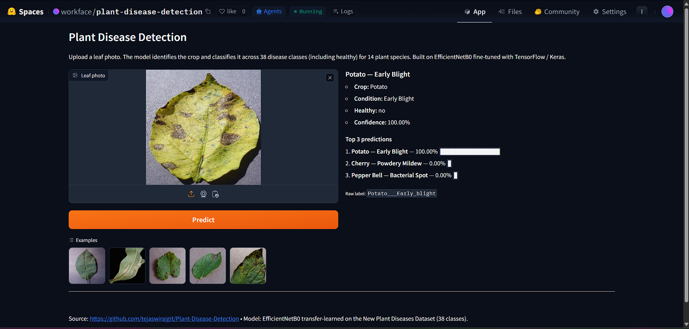
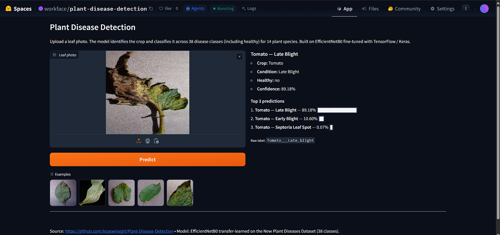
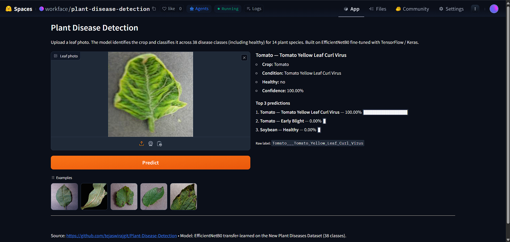

# Plant Disease Detection

[](https://huggingface.co/spaces/workface/plant-disease-detection)

Multi-class plant leaf disease classifier — **38 classes** across 14 plant species — built on transfer-learned **EfficientNetB0** with TensorFlow / Keras 2.12. Reference run reached ~99.84% validation accuracy.

## Live Demo

Try it without installing anything: **<https://huggingface.co/spaces/workface/plant-disease-detection>**

### Sample predictions

Three real predictions from the live Space, spanning three different diseases across two crops:

**Diseased Potato leaf → `Potato — Early Blight` at 100.00% confidence**



**Heavily blighted Tomato leaf → `Tomato — Late Blight` at 89.18% confidence**



> Runner-up on this case was *Tomato — Early Blight* at 10.60% — a sensible Tomato/Tomato confusion since both diseases produce dark lesions on tomato leaves. The top-3 panel always exposes these alternatives so you can sanity-check edge cases.

**Tomato leaf with curling and yellowing → `Tomato — Tomato Yellow Leaf Curl Virus` at 100.00% confidence**



> TYLCV is a whitefly-transmitted virus that causes severe yield loss in commercial tomato production — one of the more economically important diseases in the dataset.

### How to use the app

1. Open the Space (link above).
2. Drop a leaf photo into the upload box, or click one of the bundled examples.
3. Click **Predict** (or wait — predictions also fire automatically when the image changes).
4. Read the right panel: predicted crop, condition, healthy / not-healthy flag, confidence, and the top-3 runner-ups with confidence bars.

The model is trained on isolated leaf photos against a plain background — works best on similar input. Photos with multiple leaves, heavy clutter, or non-leaf subjects will still produce a prediction, but with lower confidence.

### Run the app locally

```bash
pip install -r requirements.txt
python export_model.py        # only if plant_disease_model.keras isn't already on disk
python app.py
```

## Dataset

This project trains on the **[New Plant Diseases Dataset (Augmented)](https://www.kaggle.com/datasets/vipoooool/new-plant-diseases-dataset)** by [vipoooool](https://www.kaggle.com/vipoooool) on Kaggle — about **88,000 labeled leaf images** spanning 38 classes across 14 plant species: Apple, Tomato, Grape, Corn, Potato, Pepper, Strawberry, Cherry, Peach, Soybean, Squash, Raspberry, Blueberry, and Orange. It is an augmented derivative of the [PlantVillage](https://github.com/spMohanty/PlantVillage-Dataset) dataset.

The dataset is **not** committed to this repo (see `.gitignore`). Download it from Kaggle:

```bash
pip install kaggle
kaggle datasets download -d vipoooool/new-plant-diseases-dataset --unzip -p .
```

You'll need a Kaggle API token (`~/.kaggle/kaggle.json`, or `KAGGLE_USERNAME` / `KAGGLE_KEY` env vars — see [`.env.example`](.env.example)). Alternatively, the notebook also supports `opendatasets` for an in-notebook download flow with the same credentials.

## Setup

```bash
# 1. Clone
git clone https://github.com/tejaswirajgit/Plant-Disease-Detection.git
cd Plant-Disease-Detection

# 2. Create a virtual env (Python 3.10+ recommended; TF 2.12 supports up to 3.11)
python -m venv .venv
.venv\Scripts\activate           # Windows PowerShell
# source .venv/bin/activate      # macOS / Linux

# 3. Install dependencies
pip install -r requirements.txt

# 4. (Optional) Provide Kaggle credentials for dataset download
copy .env.example .env           # Windows
# cp .env.example .env           # macOS / Linux
# then fill in KAGGLE_USERNAME and KAGGLE_KEY
```

## Run

Open `Plant Leaf Disease Detection.ipynb` in Jupyter or VS Code and execute cells top-to-bottom.

> ⚠ **Patch the dataset paths first.** The notebook hardcodes the original author's `E:/MINICONDA_FILES/...` paths (an artifact of how Kaggle's `opendatasets` extracts the archive — the segment `New Plant Diseases Dataset(Augmented)/` ends up doubled there). Replace them with the in-repo layout, where it appears only once:
>
> ```python
> train_dir = 'New Plant Diseases Dataset/New Plant Diseases Dataset(Augmented)/train'
> test_dir  = 'New Plant Diseases Dataset/New Plant Diseases Dataset(Augmented)/valid'
> data_dir  = 'New Plant Diseases Dataset/test/test'
> ```

## Architecture

EfficientNetB0 (ImageNet weights, `include_top=False`) → `GlobalAveragePooling2D` → `Dense(38, softmax)`.

- Input: 224×224×3, batch size 32, `label_mode='categorical'`
- Fine-tuning: last 20 backbone layers unfrozen
- Loss: `categorical_crossentropy`, optimizer: Adam
- Callbacks: `EarlyStopping(patience=3)`, `ReduceLROnPlateau(factor=0.2, patience=2)`, `ModelCheckpoint(save_best_only=True, save_weights_only=True)`, `TensorBoard`
- Reference val accuracy: **~99.84%**

## Project layout

```text
.
├── LICENSE                              # MIT
├── README.md                            # this file
├── requirements.txt                     # pinned deps (TF 2.12 + Gradio + HF Hub)
├── .env.example                         # template for Kaggle creds (copy to .env)
├── .gitignore                           # excludes dataset, weights, secrets
├── Plant Leaf Disease Detection.ipynb   # main training pipeline notebook
├── export_model.py                      # one-shot export of .keras + class_names.json
├── app.py                               # Gradio entry point (HF Space app_file)
├── app/                                 # inference package: predict, model_utils, class_names.json
├── examples/                            # bundled leaf photos shown in the Gradio UI
├── docs/                                # README screenshots (sample predictions)
└── New Plant Diseases Dataset/          # gitignored — Kaggle data
```

## License

[MIT License](LICENSE) © 2026 Tejaswi Raj
